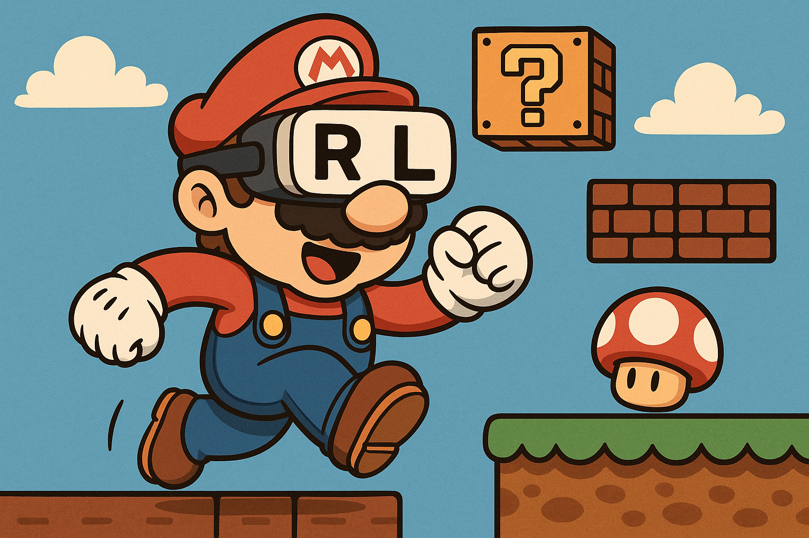

# Learn Reinforcement Learning with Mario

  
   
  <em>Project hero illustration</em>
   

## Overview
This repository uses Super Mario Bros as a practical playground to learn and implement core Reinforcement Learning (RL) algorithms. The codebase is modular: environments, networks, algorithms, and utilities are separated so multiple algorithms can be implemented and tested consistently.

## Project Structure
- `enviroments/`: Environment wrappers and parallel environment manager
- `algorithms/`: Base interfaces and algorithm implementations
- `networks/`: Neural network architectures
- `utils/`: Utilities for logging, buffers, and helpers
- `models/`: Saved model checkpoints
- `logs/`: Training logs and summaries
- `usage/`: Per-algorithm usage guides and notes
- `train.py`, `test.py`, `config.py`: Training/testing entry points and settings

## Usage Guides
Detailed train/test instructions for each algorithm live under `usage/`:
- PPO: `usage/ppo.md`

As more algorithms are added (e.g., DQN, A2C, SAC), their guides will appear as `usage/<algo>.md`.

## Extending
- Implement a new algorithm by subclassing `BaseRLAlgorithm` in `algorithms/`
- Provide a factory/helper similar to `create_ppo_algorithm`
- Add a usage guide under `usage/<algo>.md`
